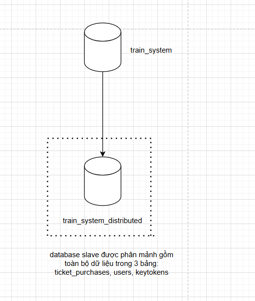
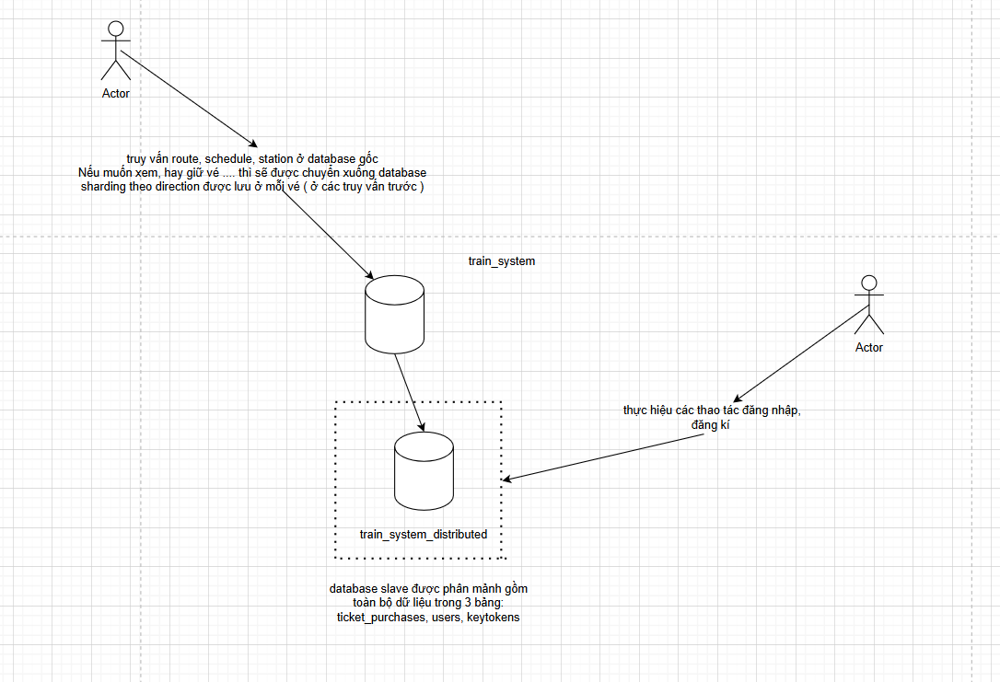

# 🚆 Project: VeTauTet

> **Sử dụng Kafka để xử lý đồng thời và nâng cao hiệu suất đáp ứng dịch vụ Website bán vé tàu**

## 📋 Mục lục

- [Công nghệ sử dụng](#️-công-nghệ-sử-dụng)
- [Hướng dẫn cài đặt](#-hướng-dẫn-cài-đặt)
- [Kiến trúc Database](#️-kiến-trúc-database)
- [Công nghệ xử lý hiệu suất cao](#-công-nghệ-xử-lý-hiệu-suất-cao)
- [Sơ đồ hệ thống](#-sơ-đồ-hệ-thống)
- [Liên hệ & Hỗ trợ](#-liên-hệ--hỗ-trợ)
- [Đánh giá hiệu năng](#-Đánh-giá-hiệu-năng)


---

## 🛠️ Công nghệ sử dụng

| Công nghệ | Mô tả |
|-----------|-------|
| **ExpressJS** | Framework cho Node.js |
| **Sequelize** | ORM cho SQL SERVER |
| **Redis** | Cache database |
| **KafkaJS** | Kafka client cho Node.js |
| **jsonwebtoken** | Xác thực API |

---

## 🚀 Hướng dẫn cài đặt

### Bước 1: Clone project
```bash
git clone https://github.com/AdamFakee/vetautet.git
```

### Bước 2: Tạo database master
Chạy file SQL để tạo database:
```sql
./figure/sql_cmd_vettautet.sql
```

### Bước 3: Cấu hình database slave
Tạo database slave bao gồm các bảng:
```
ticket_purchases
users
keytokens
```

### Bước 4: Cài đặt Docker Desktop
```
Tải và cài đặt Docker Desktop từ [docker.com](https://www.docker.com/products/docker-desktop/)
```
### Bước 5: Chạy các container Docker

#### Redis
```bash
docker run -d --name redis -p 6379:6379 redis:latest
```

#### Kafka
```bash
docker run -p 9092:9092 apache/kafka:4.0.0
```

#### K6 (Load Testing)
```bash
docker pull grafana/k6
```

### Bước 6: Cấu hình database
Chỉnh sửa file cấu hình database:
```
./src/configs/database.config
```

### Bước 7: Cài đặt dependencies
```bash
npm install
```

### Bước 8: Khởi chạy server
```bash
npm start
```

### Bước 9: Tạo dữ liệu mẫu
Gọi các API endpoints để tạo dữ liệu:

```http
POST /admin/station/create/list
POST /admin/train/create/list
POST /admin/route/create/list
POST /admin/schedule/create/list
POST /admin/tickets/create/list
```

### Bước 10: Chạy test hiệu năng
```bash
# Chạy file test K6
./k6/script.js
```

---

## 🗄️ Kiến trúc Database

### Database Sharding
- **Mục đích**: Phân mảnh để giảm tải cho database gốc
- **Tách biệt Authentication**: Do phần mã hóa có thời gian phản hồi lâu, chiếm connection lâu và dễ gây timeout
- **Tách biệt Purchases**: Phần này được truy vấn nhiều khi người dùng xem lại hóa đơn hoặc kiểm tra trạng thái mua vé

### Database Slave
Bao gồm các bảng:
- `users`
- `ticket_purchases` 
- `keyTokens`

### Đồng bộ hóa dữ liệu
- **Tự động**: Đồng bộ từ database slave về database master
- **Lịch trình**: Hàng ngày vào 5h sáng (thời điểm ít người dùng)
- **Tính toàn vẹn**: Việc thêm/sửa ở database master không ảnh hưởng đến tính toàn vẹn dữ liệu

### Sơ đồ EER


---

## ⚡ Công nghệ xử lý hiệu suất cao

### Redis
- **Single Thread**: Đảm bảo tính đồng nhất dữ liệu
- **Giảm tải**: Giảm áp lực cho database gốc
- **Cache**: Tăng tốc độ truy vấn

### Kafka
- **Message Queue**: Xử lý hiệu suất cao
- **Use Cases**: 
  - Giữ vé (holding ticket)
  - Hủy giữ vé (release ticket) 
  - Thanh toán (payment)
- **Message Key**: `ticket_id` để đảm bảo thứ tự xử lý
- **Single Thread**: Đảm bảo thứ tự message cùng ticket_id

#### ⚠️ Vấn đề hiện tại
- Kafka đảm bảo hiệu suất API nhưng chưa xử lý hoàn toàn trường hợp handle message bị lỗi

---

## 📊 Sơ đồ hệ thống

### 🔹 Truy vấn cơ bản với Redis


### 🔹 Xử lý Messages với Kafka + Redis  

*Cấu trúc tổng quan trong việc xử lý lượng lớn requests mua, giữ, hủy giữ vé*

### 🔹 Database Sharding


### 🔹 Use Case cơ bản

*Các tương tác cơ bản giữa người dùng và hệ thống bán vé tàu*

---

## 🦾 Đánh giá hiệu năng

### Cấu hình thông số kiểm thử  
 

---

### Kết quả kiểm thử theo tiêu chí của phần mềm  


#### 📝 Thông số do phần mềm định nghĩa
- `http_req_failed`: Tỉ lệ request thất bại (chỉ 200/201/204 được tính là thành công).  
- `http_reqs`: Tổng số request đã thực hiện.  
- `http_req_duration`: Thời gian từ lúc gửi request đến khi nhận phản hồi.  
- `dropped_iterations`: Số lượng iteration bị hủy do quá tải hoặc timeout.  
- `p(n)`: Phân vị thứ n, ví dụ `p(95)` là thời gian phản hồi nhanh nhất của 95% request.

---

### Kết quả kiểm thử theo tiêu chí của tôi  


#### 📝 Chú thích các thông số custom
- `signup_time_ms`: Thời gian xử lý yêu cầu tạo tài khoản.  
- `ticket_check_time_ms`: Thời gian xử lý yêu cầu xem thông tin vé.  
- `holding_time_ms`: Thời gian xử lý yêu cầu giữ vé.  
- `payment_time_ms`: Thời gian xử lý yêu cầu thanh toán.  
- `cancel_time_ms`: Thời gian xử lý yêu cầu bỏ giữ vé.  
- `successful_signups`: Tổng số yêu cầu tạo tài khoản thành công (bao gồm cả conflict).  
- `successful_checks`: Tổng số yêu cầu xem thông tin vé thành công.  
- `successful_holdings`: Tổng số yêu cầu giữ vé thành công.  
- `successful_payments`: Tổng số yêu cầu thanh toán thành công.  
- `successful_cancels`: Tổng số yêu cầu hủy giữ vé thành công.  
- `failed_requests`: Tổng số yêu cầu bị server từ chối thực hiện (status code ≥ 500).  
- `success_rate`: Tỉ lệ yêu cầu thành công (chỉ tính các status code 200, 201, 204).  
> **Lưu ý**: Các response có mã lỗi như `404 Not Found` hoặc `409 Conflict` vẫn được xem là thành công vì đã được xử lý hợp lệ về mặt logic.

---

## 📞 Liên hệ & Hỗ trợ

Nếu gặp vấn đề trong quá trình cài đặt hoặc sử dụng, vui lòng tạo issue trên GitHub repository.

---

<div align="center">
  <strong>🎯 Mục tiêu: Xây dựng hệ thống bán vé tàu hiệu suất cao với khả năng xử lý đồng thời tối ưu</strong>
</div>
